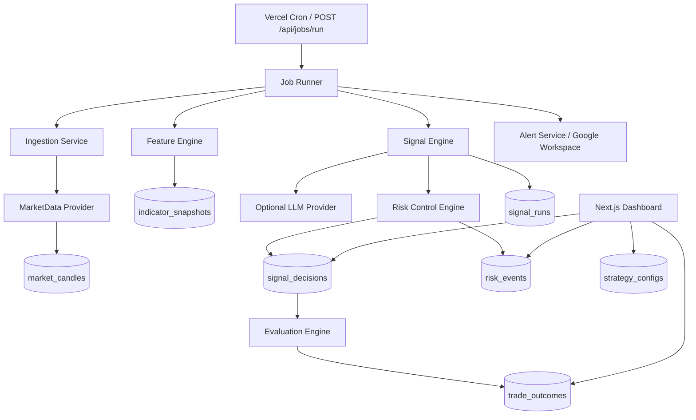

# signals-engine (MVP)

Production-sensible private signal generation platform focused on deterministic, auditable setup generation and risk gating. This project is intentionally **signal-first** (no broker execution in v1).

## Stack
- Next.js App Router + TypeScript
- Supabase Postgres as source of truth
- Vercel-compatible API routes + cron-triggerable jobs
- Structured JSON logging
- Vitest for unit/integration tests

## What this MVP includes
- Market ingestion module with provider abstraction (`mock` implementation + pluggable `alpha_vantage` interface).
- Deterministic feature engine (EMA20/50/200, ATR14, ADX14, RSI14 + session/regime states).
- Signal engine with deterministic layer first and optional LLM review layer second.
- Separate risk control engine (kill switch, duplicate blocker, budgets, cooldown, min RR, hours/news windows).
- Full audit trail persistence (`signal_runs`, `signal_decisions`, errors included).
- Outcome evaluation utilities (status + R multiple + expectancy/win rate summaries).
- Private dashboard pages (signals, metrics, risk/system health, config).
- API contracts for latest signals, single signal detail, job run trigger, summary metrics.

## Architecture


## Data model & migrations
Migration file:
- `supabase/migrations/202603300001_init.sql`

Tables:
- `instruments`
- `market_candles`
- `indicator_snapshots`
- `signal_runs`
- `signal_decisions`
- `trade_outcomes`
- `risk_events`
- `strategy_configs`
- `system_jobs`

## API contracts (sample)

### GET `/api/signals/latest`
Query params: `symbol`, `timeframe`, `status` (all optional)

Response:
```json
{
  "data": [
    {
      "id": "uuid",
      "symbol": "BTCUSD",
      "timeframe": "M30",
      "setup_type": "buy_setup",
      "status": "pending",
      "risk_reward": 2.0
    }
  ]
}
```

### GET `/api/signals/:id`
Response:
```json
{
  "data": {
    "id": "uuid",
    "symbol": "XAUUSD",
    "signal_runs": {
      "features_json": {},
      "final_signal_json": {}
    }
  }
}
```

### POST `/api/jobs/run`
Headers: `x-job-secret: <JOB_SHARED_SECRET>`

Response:
```json
{
  "ok": true,
  "result": { "processed": 2 }
}
```

### GET `/api/metrics/summary`
Response:
```json
{
  "data": {
    "total": 100,
    "closed": 80,
    "winRate": 0.55,
    "expectancy": 0.18,
    "rolling30": [],
    "bySymbol": {}
  }
}
```

## Local development
1. Install dependencies:
   ```bash
   npm install
   ```
2. Copy env file and set secrets:
   ```bash
   cp .env.example .env.local
   ```
3. Apply SQL migration in your Supabase project.
4. Seed initial config/instruments:
   ```bash
   npm run db:seed
   ```
5. Start app:
   ```bash
   npm run dev
   ```

## Scheduled jobs on Vercel
Use Vercel Cron to invoke `POST /api/jobs/run` every 30 minutes with `x-job-secret` header.

Recommended sequence per run:
1. ingest candles
2. compute/store feature snapshots
3. generate + risk-gate signals
4. persist audit trail
5. send alerts
6. (optional extension) evaluate pending outcomes and send daily summary

## Testing
```bash
npm run test
npm run typecheck
npm run lint
```

## Honest limitations / stubs
- Real provider (`AlphaVantageProvider`) is interface-only and intentionally not wired to remote API yet.
- LLM provider is optional and currently stubbed for strict JSON judgment.
- Dashboard auth/privacy hardening is not yet implemented (private deployment expected in MVP).
- Daily summary scheduler endpoint is not separated yet; integrate as additional cron route if needed.

## Design decisions
- Default behavior is conservative (`no_trade` when deterministic filters fail).
- Risk controls are a separate engine and can veto any setup.
- Everything important is persisted for post-hoc audit.
- Execution/broker integration is explicitly out of scope for v1.
