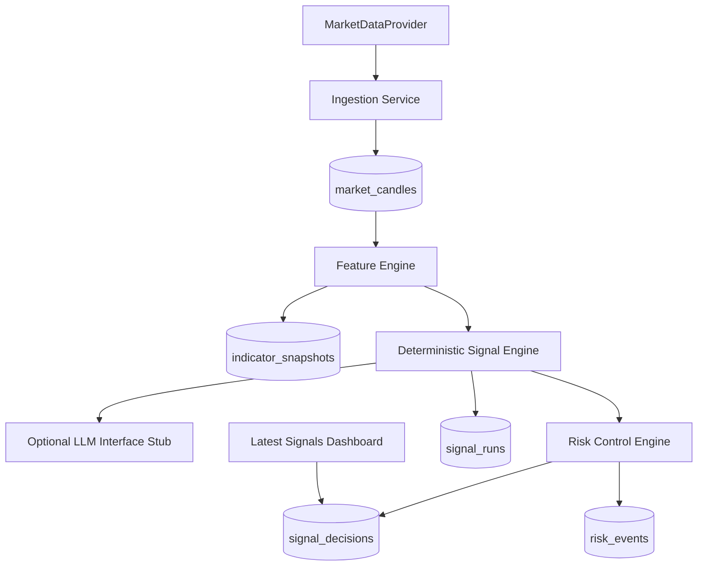

# signals-engine (Phase 1 MVP)

Phase 1 delivers a deterministic, auditable signal foundation:
- schema
- market data abstraction
- feature engine
- deterministic signal engine
- risk control engine
- latest signals dashboard
- tests for deterministic logic and risk controls

Broker execution is intentionally **out of scope**.

## Stack
- Next.js App Router + TypeScript
- Supabase Postgres
- Zod validation
- Vitest tests

## Phase 1 modules

### 1) Schema
Migration: `supabase/migrations/202603300001_init.sql`

Tables:
- `instruments`
- `market_candles`
- `indicator_snapshots`
- `signal_runs`
- `signal_decisions`
- `risk_events`
- `strategy_configs`

### 2) Market data abstraction
- `MarketDataProvider` interface
- `MockMarketDataProvider` for deterministic local operation
- `AlphaVantageProvider` as pluggable interface stub (not required to run)

### 3) Feature engine
Computes deterministic features per symbol/timeframe:
- EMA20/EMA50/EMA200
- ATR14
- ADX14
- RSI14
- session tag
- volatility regime
- trend regime
- pullback/reclaim state

### 4) Deterministic signal engine
Two-layer model:
1. Deterministic filters first
2. Optional LLM judgment behind interface (stubbed and optional)

If deterministic criteria fail, engine returns `no_trade`.

### 5) Risk control engine
Separate from signal generation. Guards include:
- instrument enabled/disabled
- kill switch
- max open trades
- daily risk budget
- cooldown after losses
- duplicate blocker
- minimum risk-reward
- news-window block
- setup validity

### 6) Latest signals dashboard
- `app/dashboard/signals/page.tsx`
- Supports filtering by `symbol`, `timeframe`, and `status` query params

### 7) Tests
- `src/tests/signal-engine.test.ts`
- `src/tests/risk-engine.test.ts`

## API contract (Phase 1)

### GET `/api/signals/latest`
Optional query params:
- `symbol`
- `timeframe`
- `status`

Response:
```json
{
  "data": [
    {
      "id": "uuid",
      "symbol": "BTCUSD",
      "timeframe": "M30",
      "setup_type": "buy_setup",
      "status": "pending",
      "risk_reward": 2.0
    }
  ]
}
```

## Seed
Seed base instruments/config:
```bash
npm run db:seed
```

## Local setup
1. Install dependencies
   ```bash
   npm install
   ```
2. Set environment
   ```bash
   cp .env.example .env.local
   ```
3. Apply migration in Supabase
4. Seed config/instruments
   ```bash
   npm run db:seed
   ```
5. Run app
   ```bash
   npm run dev
   ```

## Run tests
```bash
npm run test
```

## Mermaid architecture (Phase 1)

